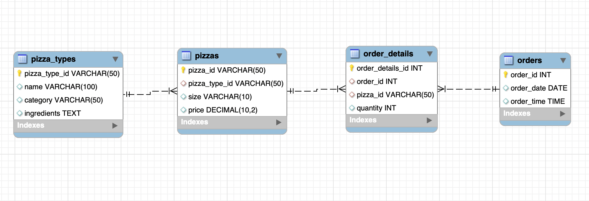
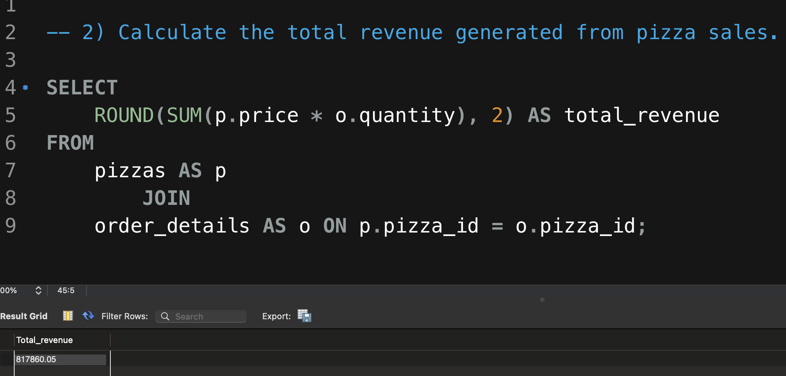
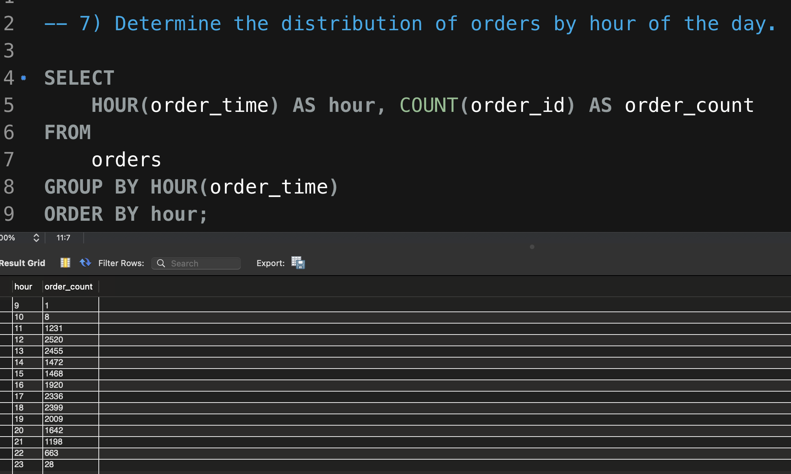
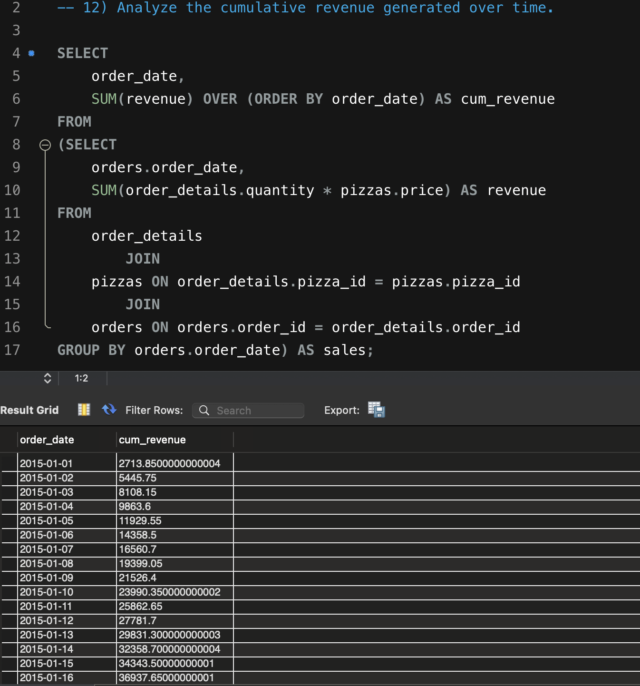
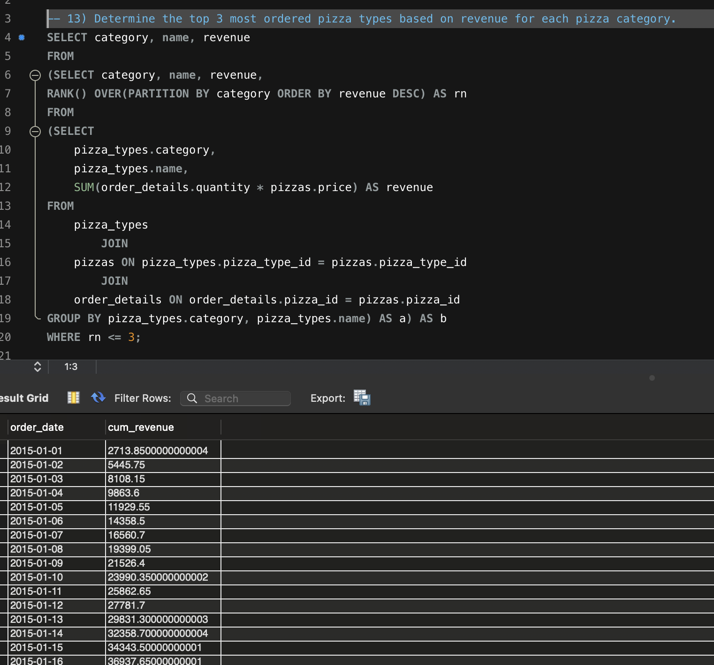

# 🍕 Pizza Sales Analysis Using SQL

## 📌 Project Overview

This project analyzes pizza sales data using MySQL. The goal is to understand sales performance, customer ordering patterns, revenue trends, and product-level performance.

## 📂 Dataset

The dataset contains four related tables:

* `orders` — contains order dates and order times
* `order_details` — contains pizza quantities for each order
* `pizzas` — contains pizza sizes and prices
* `pizza_types` — contains pizza names, categories, and ingredients

## 🛠️ Tools Used

* MySQL
* MySQL Workbench
* GitHub

## 💻 SQL Concepts Used

* `JOIN`
* `GROUP BY`
* `ORDER BY`
* Aggregate Functions
* Subqueries
* Window Functions
* `RANK()`
* `PARTITION BY`
* Cumulative `SUM()`

## ❓ Questions Solved

### 🟢 Basic Analysis

1. Retrieved the total number of orders placed
2. Calculated the total revenue generated from pizza sales
3. Identified the highest-priced pizza
4. Identified the most commonly ordered pizza size
5. Listed the top five most ordered pizza types by quantity

### 🟡 Intermediate Analysis

1. Calculated the total quantity ordered for each pizza category
2. Determined the distribution of orders by hour
3. Analyzed the category-wise distribution of pizza types
4. Calculated the average number of pizzas ordered per day
5. Identified the top three pizza types based on revenue

### 🔴 Advanced Analysis

1. Calculated the percentage contribution of each pizza type to total revenue
2. Analyzed cumulative revenue over time
3. Identified the top three pizza types by revenue within each pizza category

## 📁 Repository Structure

* `pizza_sales_analysis.sql` — contains all SQL queries used in the project
* `database_setup.sql` — contains the database and table creation statements
* `dataset/` — contains the four CSV dataset files
* `screenshots/` — contains selected SQL query and result screenshots
* `schema/` — contains the database relationship diagram

## 📊 Key Insights

* **Total number of orders:** 21,350
* **Total revenue generated:** $817,860.05
* **Highest-priced pizza:** The Greek Pizza, XXL size, priced at $35.95
* **Most commonly ordered pizza size:** Large, appearing in 18,526 order-detail records
* **Top revenue-generating pizza type:** The Thai Chicken Pizza, generating $43,434.25
* **Peak ordering period:** Orders were strongest during lunch from **12:00 PM to 1:00 PM** and during the evening from **5:00 PM to 7:00 PM**, with the highest number of orders recorded at **12:00 PM, with 2,520 orders**
* **Category-wise pizza distribution:** Supreme and Veggie contained the highest number of pizza types, with **9 varieties each**, followed by Classic with **8** and Chicken with **6**

## 🗂️ Database Schema

## 📸 Query Screenshots

### Total Revenue

### Orders by Hour

### Cumulative Revenue

### Top Three Pizzas by Category

## ✅ Conclusion

This project strengthened my understanding of SQL by allowing me to work with multiple related tables and solve business-focused questions. I used joins, aggregate functions, subqueries, and window functions to analyze pizza sales, revenue trends, ordering patterns, and product performance.
